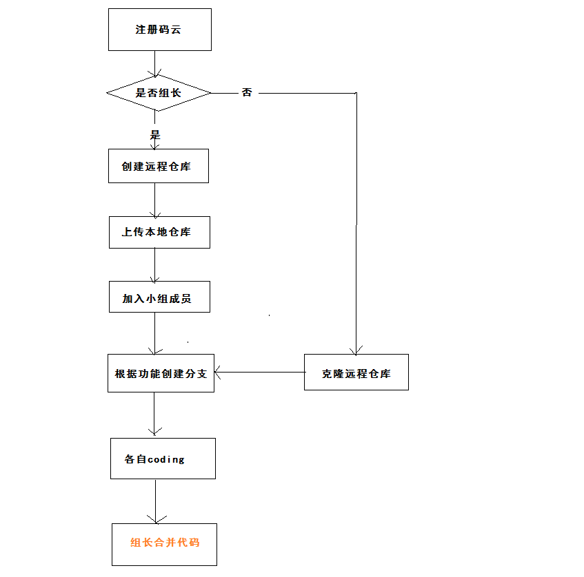

## 团队实战

### 01-项目描述

针对目前大量学员在培训完之后直接去面试企业的通过率低的问题，公司研发了黑马面面小程序，学员在空闲时间可以通过查看企业真实面试题，不仅可以查看企业真题，也可以通过刷题寻找自己的短板进行补充，新版本提供模拟面试功能，用户可以通过微信小程序进入模拟面试模块，完成定向企业面试和自由组题模式。


### 02-项目分析

主要是src目录分析：

```shell
├─api
│  ├─base     # 基础接口API
│  ├─example  # 例子
│  └─hmmm     # 功能接口API
├─assets      # 静态资源
├─components  # 组件
├─filters
├─icons
├─lang
├─mixins
├─mock
├─module-dashboard
├─module-details
├─module-form
├─module-hmmm   # 待完成的功能
│  ├─components # 组件
│  ├─pages      # 页面组件（包含8个页面） **重点**    
│  ├─router     # 模块路由
│  └─store      # 存储数据
├─module-list
├─module-manage
├─router        # 全局路由
├─store         # 存储数据
├─styles        # 样式
└─utils         # 工具
```

### 03-项目演示

- 接口文档：<https://mock.boxuegu.com/project/19/interface/api>
- 接口服务器：<http://192.168.50.201:7001/>   （config/index.js/target字段修改）
  - 当然可以搭建本地的接口服务器
  - hmmm-backend 后端项目
  - mianmian.sql 数据库文件
- 原型：[http://czpm.itcast.cn/黑马面面/V2.0/](http://czpm.itcast.cn/%E9%BB%91%E9%A9%AC%E9%9D%A2%E9%9D%A2/V2.0/)
- 设计稿：只做参考，主要依据原型。

### 04-分配任务

- 大家注册 <https://gitee.com/>  码云帐号
- 组长创建仓库，命名规则  hmmm-班级-组号 （hmmm-70-01）
- 上传本地仓库，代码会发给大家。
- 在远程仓库添加仓库成员，就是小组成员，按用户名搜索即可，可批量。
- 小组成员克隆远仓库到本地
- 各自以自己的名字全拼创建分支
- 在自己的分支上开发各自分配的功能
  - 基础题库
  - 精选题库
  - 题库添加
  - 组题列表
  - 学科管理
  - 目录管理
  - 标签管理
  - 面试技巧
- 组长合并分支  

拉取远程分支并创建本地分支

方法一

使用如下命令：

```
git checkout -b 本地分支branch_x origin/远程分支名name
```

使用该方式会在本地新建分支branch_x，并自动切换到该本地分支branch_x。

方式二

使用如下命令：

```
git fetch origin 远程分支名name:本地分支branch_x
```

使用该方式会在本地新建分支branch_x，但是不会自动切换到该本地分支branch_x，需要手动checkout。

### 05-问题答疑


##### 05-01 npm包node-sass

- 需要重新安装，之前的是基于8.x版本node，大家的是10.x版本。

```bash
npm un node-sass
npm i node-sass
```


##### 05-02 远程仓库必须是空仓库

- 在创建的时候，不需要勾选 readme.md 默认创建。


##### 05-03  gitee输入用户名和密码提交

- 配置免用户名密码认证提交  ssh协议提交

  - 生成公钥

  ```bash
  ssh-keygen -t rsa
  ```

  - 一路回车即可
  - 去C盘 ---> 当前用户的文件夹 ---> .ssh文件夹 ---> .pub后缀的文件 ---> 拷贝内容
  - 去gitee平台 配置公钥（拷贝内容）

  
  - 完成，注意提交的地址换成  git@gitee.com:zhoushugang/hmmm-70-01.git
  - 如果是第一次ssh提交，窗口对话信息，输入 yes  即可。


##### 05-04 仓库创建问题

- 组长  创建一个  远端仓库
  - 注意：空仓库  不需要勾选 readme.md文档
- 上传项目到远端仓库
  - 初始化本地仓库
  - 提交暂存区
  - 第一次提交版本库  master分支
  - git push  远端仓库的地址  master
- 添加组内成员
- 让成员拉取代码
  - git clone 远端仓库的地址 项目的名称
  - 注意：**是本地创建分支**
  - 在自己的分支  开始写代码
  - 最好  写完一个完整的功能  推送本地分支到远端